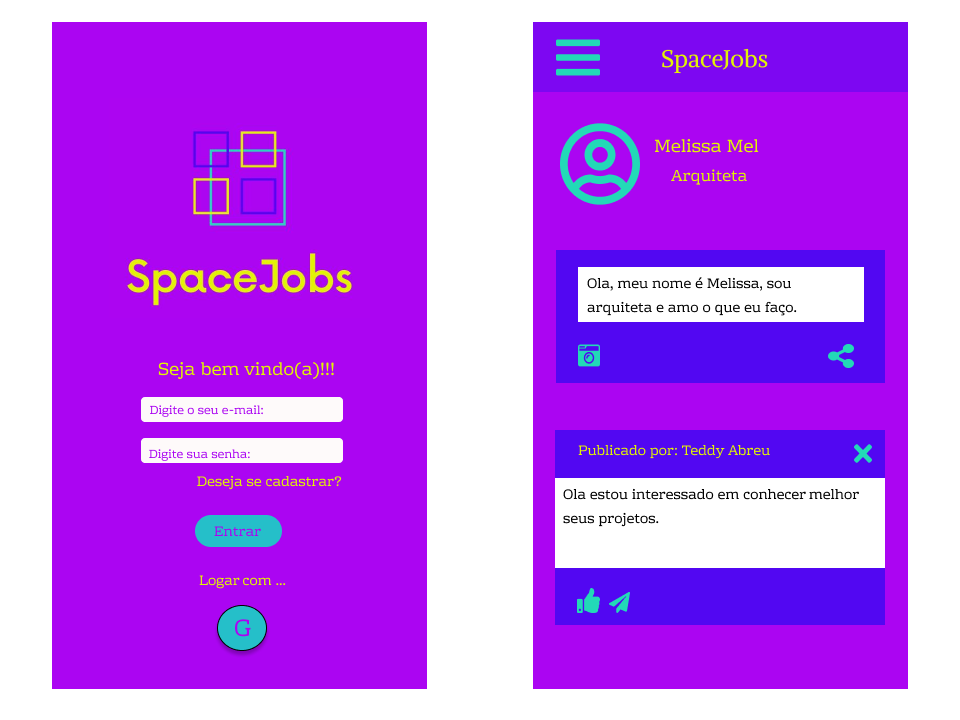

# SpaceJobs

## 1. Definição do produto
SpaceJobs é uma plataforma para profissionais divulgarem os seus trabalhos, podendo ser contatados caso outra pessoa tenha interesse no seu serviço . No SpaceJobs, o usuario tambem poderá encontrar os profissionais que deseja e ver seus trabalhos antes de contratá-los, tendo assim uma maior confiança em seu serviço, podendo tambem compartilhar e indicar os profissionais que conhece para outras pessoas da rede. Pensando na acessibilidade desenvolvemos um site responsivo, no conceito mobile first, o qual é possível ser acessado por vários tipos de dispositivos, como computador, celular, tablet, etc.

 [Clique aqui para acessar o SpaceJobs.](https://rede-social-sap004.web.app/)

## 2. Usuário

O Projeto foi pensado e desenvolvido para todos os profissionais que desejam divulgar seus trabalhos e projetos, bem como para os usuarios que estão buscando por algum profissional de determinada área. 

## 3. Funcionalidades
* Novos usuários podem se cadastrar na rede através do cadastro do próprio site ou pelo login do Google;
* Usuários já cadastrados podem acessar a plataforma através de email e senha ou pelo login do Google;
* No feed de postagens é possível visualizar todas as postagens, tanto do usuario logado quanto de outros usuários, ordenadas das mais recentes às mais antigas. O usuario pode escolher se quer visualizar somente suas postagens ou todas as postagens;
* O usuário pode publicar texto e imagens em seus posts, pode escolher a privacidade do post se deseja deixar privado(só o usuário que postou pode ver) ou público(todos os usuários podem ver) e tambem podem editar e deletar seus posts após publicado;
* Os usuarios podem dar like ou desfazê-lo, além de comentar um post e editar ou deletar o seu proprio comentário;
* No perfil o usuário pode editar as informações do seu perfil, tais como foto, nome, profissão, local e se desejar adicionar uma pequena biografia.

## 4.1.  Protótipo fornecido
Para esse projeto, nos foi fornecido um layout pronto, para ser usado como parametro para o desenvolvimento do site.

* Telas mobile 

  

  * Telas Web

  

## 4.2. Protótipo final
Com base no layout fornecido, criamos um protótipo no Figma de como ficaria nossa pagina e então começarmos a desenvolvê-la. 

* Telas Mobile

  

* Telas Web

  
  

## 5. Considerações técnicas

Ferramentas utilizadas no projeto:

* HTML, CSS, JavaScript, Node.js, Npm, VS Code, Firebase, Figma, Git e GitHub.

## 6. Considerações finais

* A funcionalidade cumpre e satisfaz os critérios de aceitação.
* O layout está de acordo com o protótipo.
* O código desta funcionalidade recebeu code review.
* A funcionalidade está publicada para ser testada.
* A funcionalidade foi testada manualmente.

## Autoras

[Karine Sardela](https://github.com/kfsardela), [Luana Aredes](https://github.com/luana-aredes) e [Aline Rozetti ](https://github.com/alinerozetti).

Projeto desenvolvido para fins de aprendizado no Bootcamp da [Laboratória Brasil](https://www.laboratoria.la/br). 

